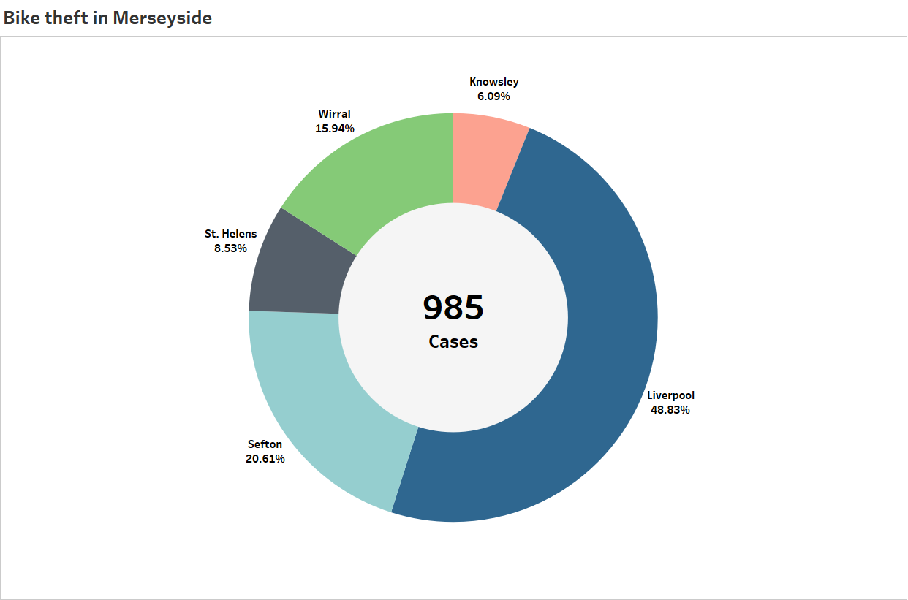
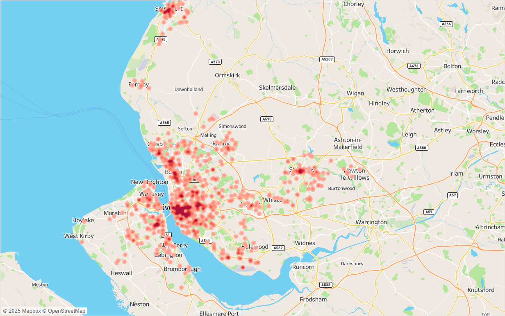
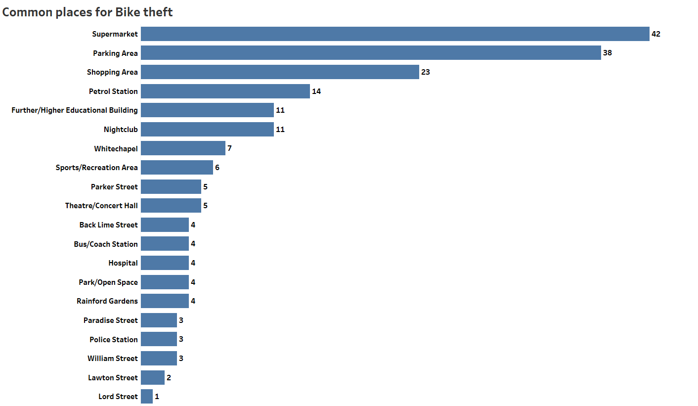
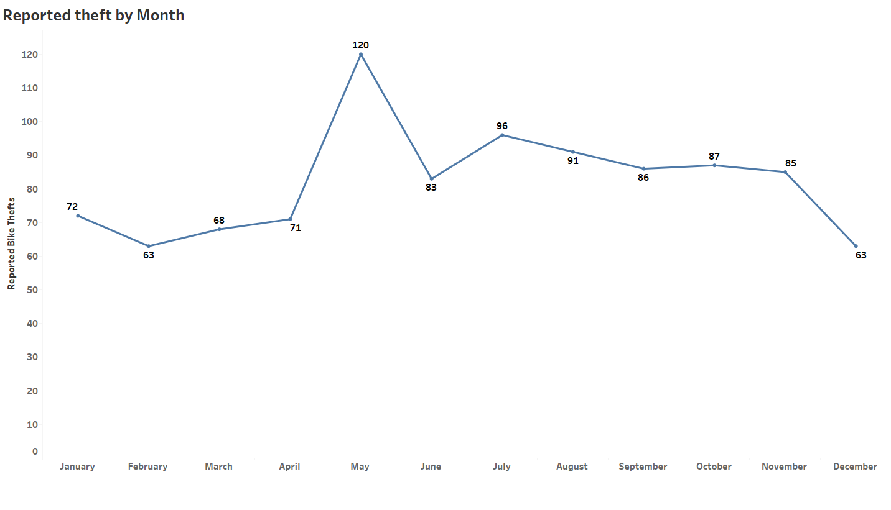
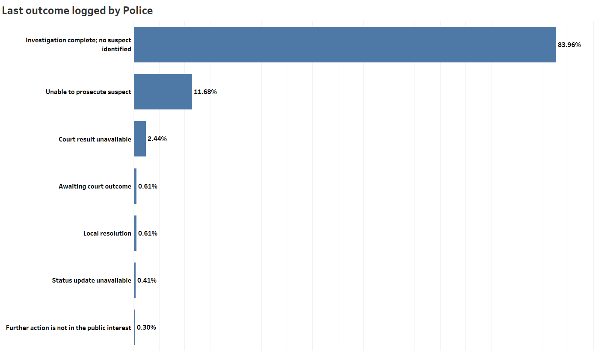
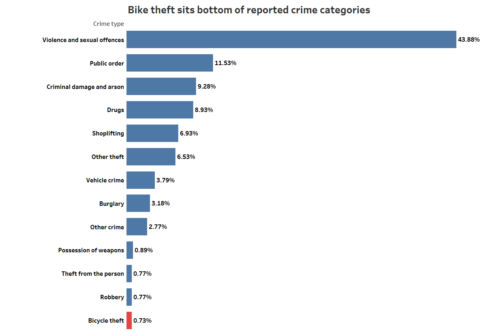

# Active Travel Hackday - Bike theft in Merseyside

At the [Active Travel Hackday](https://events.doesliverpool.com/events/a0c91251-7a5b-4420-b011-94a44fb42a60) hosted by Adrian McEwen at [DoES Liverpool](https://doesliverpool.com/), a few of us decided to dig into what every cyclist dreads: **bike theft**. Liverpool might be building momentum around cycling and active travel, but what happens when the bikes go missing?

I joined a small team looking at data pulled from [data.police.uk API](https://data.police.uk/) on reported bike thefts by Merseyside Police, and the results were quite an eye-opener.

## The Hotspots: Where Bikes Disappear Most

In 2024, nearly 1,000 bike thefts were reported across Merseyside.
The data revealed clear hotspots. The most frequent locations were:

- Supermarkets

- Public parking areas

- Shopping centres

These are the places where many of us feel safe locking our bikes for a short time. Yet convenience often comes at a cost. The easier a spot is to access, the easier it is for thieves to strike.

 

## Why May Tops the Charts

When we looked at monthly trends, May recorded the highest number of thefts.

Why May? Several factors might explain it.

- The weather improves and more people start cycling again.

- Longer days bring more outdoor activity.

- Events and social outings increase the number of bikes on the streets.

More bikes in circulation simply means more opportunities for theft.

## The Harsh Reality: You Might Never See It Again

Recovery rates for stolen bikes were alarmingly low.
According to the data:

- **84%** of thefts ended with no suspect identified.

- **Less than 1%** led to any form of local resolution.

- Even when suspects were identified, prosecutions were uncommon.

This means that most people who lose their bikes never get them back. It is not necessarily because the police do not care, but rather because bike thefts are difficult to solve and rarely prioritised.

## Not a Police Priority

Bike theft accounted for just 0.73% of all reported crimes to the Merseyside police in 2024.
That figure is small compared to other crime categories. With limited resources, it is understandable that investigations into bike thefts often do not lead to arrests or recoveries.

## What Cyclists Can Do

- Avoid leaving your bike at supermarkets or car parks for long periods.

- Use multiple locks (for example, a D-lock and a cable lock).

- Register your bike on services such as [BikeRegister](https://www.bikeregister.com/) to increase the chance of recovery if it is stolen.

It might also be worth pushing for more secure public cycle parking across the region, especially at supermarkets and transport areas.

## The Takeaway

Bike theft might not be a headline issue, but it shapes how safe and confident people feel about cycling. If Liverpool City Region wants to build a stronger cycling culture, protecting bikes needs to be part of the conversation.

Until then, stay alert, lock smart, and remember: The most convenient place to park your bike might also be the riskiest.